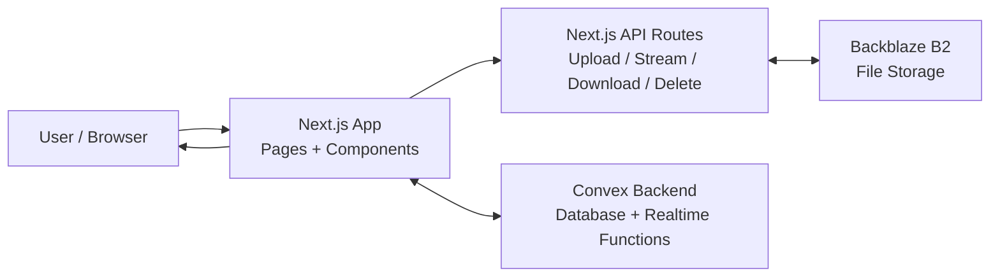
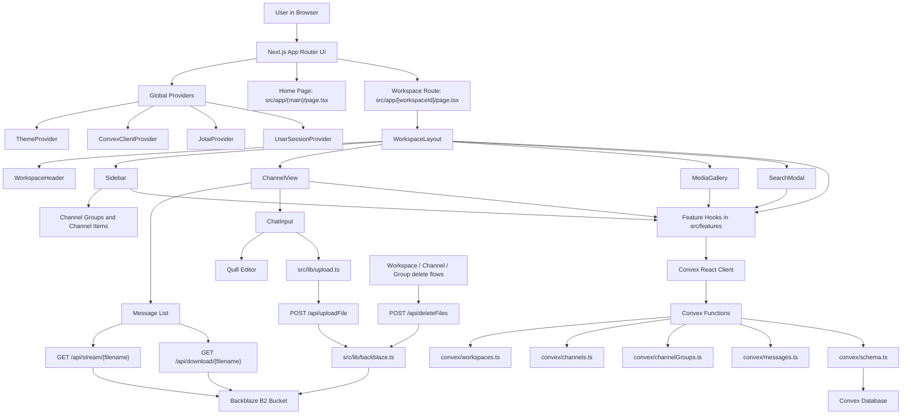
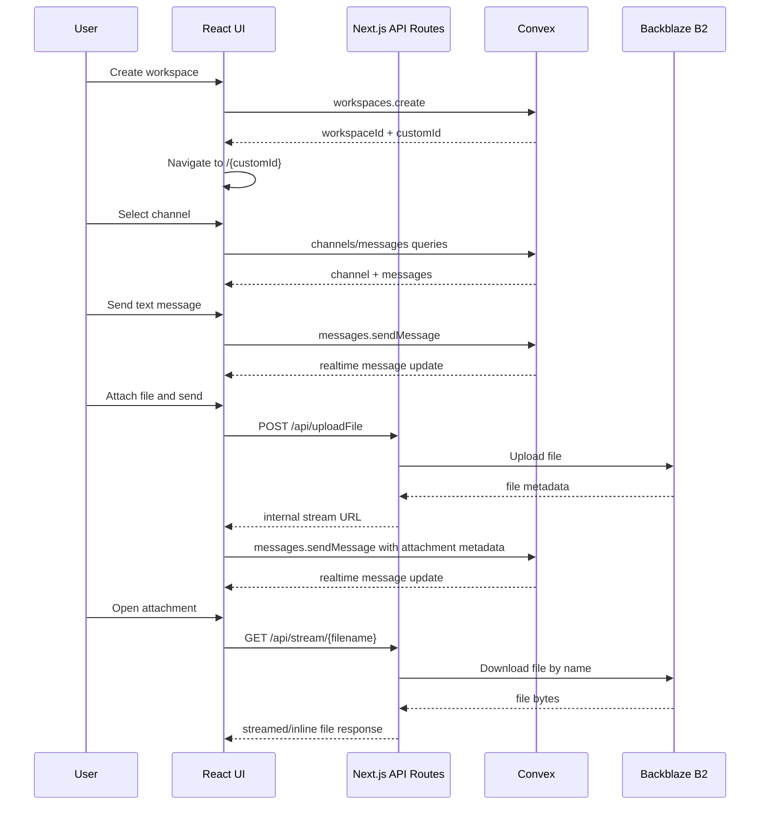
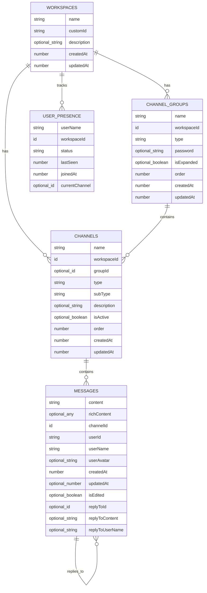

# UpFilo Project Documentation

Complete technical documentation for understanding, running, developing, and maintaining the UpFilo codebase.

## Table of Contents

- [1. Project Summary](#1-project-summary)
- [2. Technology Stack](#2-technology-stack)
- [3. Repository Layout](#3-repository-layout)
- [4. Runtime Requirements](#4-runtime-requirements)
- [5. Environment Configuration](#5-environment-configuration)
- [6. Installation and Local Development](#6-installation-and-local-development)
- [7. Available Commands](#7-available-commands)
- [8. Application Architecture](#8-application-architecture)
- [9. Mermaid Architecture Diagram](#9-mermaid-architecture-diagram)
- [10. User Flow](#10-user-flow)
- [11. Routing](#11-routing)
- [12. Providers and Global App Setup](#12-providers-and-global-app-setup)
- [13. Data Model](#13-data-model)
- [14. Convex Backend Functions](#14-convex-backend-functions)
- [15. Frontend Feature Modules](#15-frontend-feature-modules)
- [16. Workspace Experience](#16-workspace-experience)
- [17. Messaging System](#17-messaging-system)
- [18. File Upload and Storage](#18-file-upload-and-storage)
- [19. Search and Media Gallery](#19-search-and-media-gallery)
- [20. User Sessions and Presence](#20-user-sessions-and-presence)
- [21. Styling and UI System](#21-styling-and-ui-system)
- [22. API Routes](#22-api-routes)
- [23. Security Module](#23-security-module)
- [24. Build, Linting, and Testing](#24-build-linting-and-testing)
- [25. Known Implementation Notes](#25-known-implementation-notes)
- [26. Contribution Guide](#26-contribution-guide)
- [27. Troubleshooting](#27-troubleshooting)

## 1. Project Summary

UpFilo is a real-time workspace collaboration application built with Next.js and Convex. Users can create or join workspaces, organize conversations into channel groups and channels, send rich-text messages, attach files, search messages/files, and browse shared media.

The application stores structured collaboration data in Convex and stores uploaded binary files in Backblaze B2. The browser UI communicates with Convex through React hooks and with file storage through Next.js API routes.

The repository also contains a standalone Python security module under `security/` that demonstrates authenticated encryption for message packets. This module is documented separately and is not wired into the Next.js web application.

## 2. Technology Stack

| Area | Technology |
| ---- | ---------- |
| Web framework | Next.js App Router |
| UI runtime | React |
| Language | TypeScript |
| Realtime backend/database | Convex |
| File storage | Backblaze B2 |
| Styling | Tailwind CSS |
| UI primitives | Local `src/components/ui` components with Radix UI dependencies |
| Rich text editor | Quill |
| Client state | Jotai and React state |
| Theme handling | `next-themes` |
| Icons | `lucide-react`, `react-icons` |
| Notifications | `sonner` |
| Standalone crypto demo | Python with `pycryptodome` |

Key package versions are declared in `package.json`, including Next `^16.0.8`, React `^19.0.0`, Convex `^1.17.0`, and TypeScript `^5`.

## 3. Repository Layout

```text
.
|-- README.md
|-- PROJECT_DOCUMENTATION.md
|-- WORKING.md
|-- package.json
|-- package-lock.json
|-- next.config.mjs
|-- tsconfig.json
|-- tailwind.config.ts
|-- postcss.config.mjs
|-- components.json
|-- .env.example
|-- convex/
|   |-- schema.ts
|   |-- workspaces.ts
|   |-- channels.ts
|   |-- channelGroups.ts
|   |-- messages.ts
|   `-- _generated/
|-- public/
|   |-- logo.svg
|   |-- favicon.ico
|   |-- favicon-16x16.png
|   |-- favicon-32x32.png
|   |-- apple-icon.png
|   |-- android-chrome-192x192.png
|   |-- android-chrome-512x512.png
|   `-- site.webmanifest
|-- security/
|   |-- SECURITY.md
|   `-- message_crypto.py
`-- src/
    |-- app/
    |-- components/
    |-- config/
    |-- features/
    |-- hooks/
    `-- lib/
```

Important directories:

| Path | Purpose |
| ---- | ------- |
| `src/app/` | Next.js App Router pages, layouts, fonts, global CSS, and API routes. |
| `src/components/` | Workspace shell, chat UI, media gallery, providers, and reusable UI primitives. |
| `src/features/` | Feature-specific React hooks that wrap Convex queries and mutations. |
| `src/hooks/` | Helpers for reading route params and resolving workspace IDs. |
| `src/lib/` | Utility functions, upload helpers, Backblaze B2 integration, mentions, user colors. |
| `convex/` | Convex schema, queries, and mutations. |
| `convex/_generated/` | Convex-generated API and type files. Do not edit manually. |
| `security/` | Standalone Python encryption/signing module and documentation. |
| `public/` | Static assets and app icons. |

## 4. Runtime Requirements

Required for the web application:

- Node.js
- npm
- Convex project/deployment
- Backblaze B2 bucket and application credentials for file features

Required only for the standalone security demo:

- Python 3
- `pycryptodome`

The repository does not declare a Node.js engine version in `package.json`.

## 5. Environment Configuration

The project includes `.env.example`:

```env
NEXT_PUBLIC_CONVEX_URL=
CONVEX_DEPLOYMENT=
CONVEX_DEPLOY_KEY=
B2_APPLICATION_KEY_ID=
B2_APPLICATION_KEY=
B2_BUCKET_NAME=
B2_BUCKET_ID=
```

Configuration table:

| Variable | Required | Used By | Description |
| -------- | -------- | ------- | ----------- |
| `NEXT_PUBLIC_CONVEX_URL` | Yes | `src/components/convex-client-provider.tsx` | Public Convex URL used to initialize `ConvexReactClient`. |
| `CONVEX_DEPLOYMENT` | Yes for Convex CLI workflows | Convex tooling | Convex deployment identifier. |
| `CONVEX_DEPLOY_KEY` | Yes for deployment workflows | Convex tooling | Convex deployment key. Keep secret. |
| `B2_APPLICATION_KEY_ID` | Yes for file APIs | `src/lib/backblaze.ts`, download/stream routes | Backblaze B2 application key ID. |
| `B2_APPLICATION_KEY` | Yes for file APIs | `src/lib/backblaze.ts`, download/stream routes | Backblaze B2 application key. Keep secret. |
| `B2_BUCKET_NAME` | Yes for file serving | download/stream routes | Backblaze B2 bucket name. |
| `B2_BUCKET_ID` | Yes for upload/delete | `src/lib/backblaze.ts`, download route | Backblaze B2 bucket ID. |

Important security note:

- Do not commit `.env.local`.
- Do not expose real Convex deployment keys or Backblaze credentials.
- `NEXT_PUBLIC_CONVEX_URL` is intentionally public because it is used in the browser.
- `CONVEX_DEPLOY_KEY` and `B2_APPLICATION_KEY` must remain server-side secrets.

## 6. Installation and Local Development

Install dependencies:

```bash
npm install
```

Create local environment config:

```bash
cp .env.example .env.local
```

Windows PowerShell:

```powershell
Copy-Item .env.example .env.local
```

Start the full local development workflow:

```bash
npm run dev:full
```

This runs:

- `npm run dev`
- `npm run convex:dev`

Open:

```text
http://localhost:3000
```

## 7. Available Commands

Commands defined in `package.json`:

| Command | Script | Purpose |
| ------- | ------ | ------- |
| `npm run dev` | `next dev` | Starts the Next.js development server. |
| `npm run dev:full` | `concurrently "npm run dev" "npm run convex:dev"` | Runs Next.js and Convex development servers together. |
| `npm run convex:dev` | `npx convex dev` | Starts Convex development workflow. |
| `npm run build` | `next build` | Builds the Next.js application. |
| `npm run start` | `next start` | Starts the built Next.js production server. |
| `npm run lint` | `next lint` | Runs Next.js linting. |

## 8. Application Architecture

UpFilo is split into four major layers:

1. Browser UI
2. Next.js application routes and API routes
3. Convex backend functions and database
4. Backblaze B2 file storage

The browser renders client components and communicates with Convex through generated Convex APIs. Workspace data, channels, messages, and presence records are stored in Convex.

Files are uploaded through a Next.js API route, sent to Backblaze B2, and represented in Convex message `richContent.attachments` metadata. The attachment URL points back to an internal streaming API route.

## 9. Mermaid Architecture Diagram

### High-Level System Architecture



This is the simplest view of the project:

- The user interacts with the Next.js frontend.
- The frontend reads and writes realtime workspace data through Convex.
- File operations go through Next.js API routes.
- Backblaze B2 stores uploaded file binaries.

### Detailed Component Architecture



### Data Flow Diagram



### Convex Data Model Diagram



## 10. User Flow

Typical user journey:

1. User opens `/`.
2. Home page lists existing workspaces from `api.workspaces.get`.
3. User creates a workspace or enters a workspace ID/name to join.
4. Workspace names are converted into URL-friendly custom IDs.
5. User lands on `/{workspaceId}`.
6. `WorkspaceLayout` resolves the custom ID to a Convex workspace document.
7. If the browser has no display name for that workspace, `NameInputDialog` asks for one.
8. Display name is stored in `sessionStorage`.
9. User presence is updated in Convex.
10. User selects a channel from the sidebar.
11. `ChannelView` loads messages for the selected channel.
12. User sends rich-text messages and attachments.
13. Messages update through Convex subscriptions.
14. Attachments are uploaded to B2 through Next.js API routes.
15. User can search messages/files or browse the media gallery.

## 11. Routing

Main routes:

| Route | File | Purpose |
| ----- | ---- | ------- |
| `/` | `src/app/(main)/page.tsx` | Landing/workspace management page. |
| `/{workspaceId}` | `src/app/[workspaceId]/page.tsx` | Workspace UI for a custom workspace ID. |
| `/api/uploadFile` | `src/app/api/uploadFile/route.ts` | Upload/delete single files in Backblaze B2. |
| `/api/download/{filename}` | `src/app/api/download/[filename]/route.ts` | Redirect to an authorized or public Backblaze download URL. |
| `/api/stream/{filename}` | `src/app/api/stream/[filename]/route.ts` | Stream/download file bytes through the Next.js server. |
| `/api/deleteFiles` | `src/app/api/deleteFiles/route.ts` | Bulk delete Backblaze files by URLs. |

Route helper hooks:

| Hook | File | Purpose |
| ---- | ---- | ------- |
| `useWorkspaceId` | `src/hooks/use-workspace-id.ts` | Reads `workspaceId` from URL params as a custom ID string. |
| `useConvexWorkspaceId` | `src/hooks/use-convex-workspace-id.ts` | Resolves URL custom ID to a Convex workspace document ID. |
| `useChannelId` | `src/hooks/use-channel-id.ts` | Helper for channel route state where used. |

## 12. Providers and Global App Setup

The root layout is `src/app/layout.tsx`.

It configures:

- Global CSS from `src/app/globals.css`
- Site metadata from `src/config/site.ts`
- App icons and web manifest
- `ThemeProvider`
- `ConvexClientProvider`
- `JotaiProvider`
- `UserSessionProvider`
- `Toaster`

Provider responsibilities:

| Provider | File | Responsibility |
| -------- | ---- | -------------- |
| `ThemeProvider` | `src/components/theme-provider.tsx` | Applies light/dark theme behavior. |
| `ConvexClientProvider` | `src/components/convex-client-provider.tsx` | Creates and provides `ConvexReactClient` using `NEXT_PUBLIC_CONVEX_URL`. |
| `JotaiProvider` | `src/components/jotai-provider.tsx` | Provides Jotai state context. |
| `UserSessionProvider` | `src/components/user-session-provider.tsx` | Stores per-workspace display names in browser session storage. |

If `NEXT_PUBLIC_CONVEX_URL` is missing or invalid, `ConvexClientProvider` renders children without the Convex provider and logs a warning. The app UI may render, but Convex-backed data operations require a valid Convex configuration.

## 13. Data Model

The Convex schema is defined in `convex/schema.ts`.

### `workspaces`

Fields:

| Field | Type | Notes |
| ----- | ---- | ----- |
| `name` | `string` | Workspace display name. |
| `customId` | `string` | URL-friendly ID used in routes. |
| `description` | optional `string` | Workspace description. |
| `createdAt` | `number` | Timestamp in milliseconds. |
| `updatedAt` | `number` | Timestamp in milliseconds. |

Indexes:

- `by_custom_id`
- `by_name`

### `channelGroups`

Fields:

| Field | Type | Notes |
| ----- | ---- | ----- |
| `name` | `string` | Group name. |
| `workspaceId` | `id("workspaces")` | Parent workspace. |
| `type` | `"group"` or `"user"` | Standard channel group or user channel group. |
| `password` | optional `string` | Used for `type: "user"` groups. |
| `isExpanded` | optional `boolean` | Sidebar UI expansion state. |
| `order` | `number` | Ordering value. |
| `createdAt` | `number` | Timestamp in milliseconds. |
| `updatedAt` | `number` | Timestamp in milliseconds. |

Indexes:

- `by_workspace_id`
- `by_workspace_id_and_type`

### `channels`

Fields:

| Field | Type | Notes |
| ----- | ---- | ----- |
| `name` | `string` | Channel name, normalized to lowercase hyphenated format on creation/update. |
| `workspaceId` | `id("workspaces")` | Parent workspace. |
| `groupId` | optional `id("channelGroups")` | Parent group. |
| `type` | `"group"` or `"user"` | Group channel or user channel. |
| `subType` | `"text"`, `"voice"`, `"announcement"`, or `"private"` | Channel subtype. |
| `description` | optional `string` | Channel description. |
| `isActive` | optional `boolean` | Channel active flag. |
| `order` | `number` | Ordering value. |
| `createdAt` | `number` | Timestamp in milliseconds. |
| `updatedAt` | `number` | Timestamp in milliseconds. |

Indexes:

- `by_workspace_id`
- `by_group_id`
- `by_workspace_id_and_type`

### `messages`

Fields:

| Field | Type | Notes |
| ----- | ---- | ----- |
| `content` | `string` | Plain-text representation of the message. |
| `richContent` | optional `any` | Quill Delta content, mentions, and attachment metadata. |
| `channelId` | `id("channels")` | Parent channel. |
| `userId` | `string` | Currently set to `"session-user"` in `sendMessage`. |
| `userName` | `string` | Session display name. |
| `userAvatar` | optional `string` | Optional avatar URL. |
| `createdAt` | `number` | Timestamp in milliseconds. |
| `updatedAt` | optional `number` | Edit timestamp. |
| `isEdited` | optional `boolean` | Message edit flag. |
| `replyToId` | optional `id("messages")` | Parent message for replies. |
| `replyToContent` | optional `string` | Snapshot of replied-to content. |
| `replyToUserName` | optional `string` | Snapshot of replied-to author. |

Indexes:

- `by_channel_id`
- `by_user_id`
- `by_reply_to`

### `users`

Fields:

| Field | Type | Notes |
| ----- | ---- | ----- |
| `name` | `string` | User name. |
| `email` | `string` | User email. |
| `avatar` | optional `string` | User avatar. |
| `status` | `"online"`, `"offline"`, or `"away"` | User status. |
| `workspaceIds` | array of workspace IDs | Workspaces associated with the user. |
| `createdAt` | `number` | Timestamp in milliseconds. |
| `updatedAt` | `number` | Timestamp in milliseconds. |

Index:

- `by_email`

### `userPresence`

Fields:

| Field | Type | Notes |
| ----- | ---- | ----- |
| `userName` | `string` | Session display name. |
| `workspaceId` | `id("workspaces")` | Workspace being tracked. |
| `status` | `"online"`, `"offline"`, or `"away"` | Presence status. |
| `lastSeen` | `number` | Last presence update timestamp. |
| `joinedAt` | `number` | First join timestamp. |
| `currentChannel` | optional `id("channels")` | Current channel. |

Indexes:

- `by_workspace_id`
- `by_user_workspace`
- `by_workspace_status`

## 14. Convex Backend Functions

### Workspaces: `convex/workspaces.ts`

Important functions:

| Function | Type | Purpose |
| -------- | ---- | ------- |
| `generateCustomId` | helper | Converts a workspace name into a URL-friendly custom ID. |
| `create` | mutation | Creates a workspace, a default `General` channel group, and a default `general` channel. |
| `update` | mutation | Updates workspace name and/or description. |
| `remove` | mutation | Deletes workspace channels, messages, channel groups, presence records, and the workspace. Returns file URLs for external cleanup. |
| `get` | query | Returns all workspaces. |
| `getInfoById` | query | Returns basic workspace info by Convex ID. |
| `getById` | query | Returns a workspace by Convex ID. |
| `getByCustomId` | query | Returns a workspace by URL custom ID. |
| `getByName` | query | Returns a workspace by name. |
| `getActiveUsers` | query | Derives active users from recent message activity. |
| `getAllWorkspaceUsers` | query | Returns users who have interacted with a workspace; includes default demo users if none are found. |
| `updateUserPresence` | mutation | Creates or updates a presence record. |
| `getActiveUsersWithPresence` | query | Returns active users from `userPresence` and message activity. |
| `cleanupInactiveUsers` | mutation | Marks stale online/away users as offline. |

### Channels: `convex/channels.ts`

Important functions:

| Function | Type | Purpose |
| -------- | ---- | ------- |
| `get` | query | Lists workspace channels, optionally filtered by type or group ID. |
| `getById` | query | Returns one channel. |
| `create` | mutation | Creates a new normalized channel. |
| `update` | mutation | Updates channel name, description, group, and active flag. |
| `remove` | mutation | Deletes a channel and all messages in it; returns file URLs for external cleanup. |
| `reorderChannels` | mutation | Updates channel order values. |
| `getChannelsWithGroups` | query | Returns grouped and ungrouped channels for a workspace. |

### Channel Groups: `convex/channelGroups.ts`

Important functions:

| Function | Type | Purpose |
| -------- | ---- | ------- |
| `getChannelGroups` | query | Lists channel groups for a workspace, optionally by type. |
| `createChannelGroup` | mutation | Creates a group or user channel group, with optional password for user groups. |
| `updateChannelGroup` | mutation | Updates group name, expansion state, and password. |
| `verifyUserGroupPassword` | mutation | Compares supplied password to stored password for user groups. |
| `deleteChannelGroup` | mutation | Deletes group, channels in the group, messages, and returns file URLs for cleanup. |
| `reorderChannelGroups` | mutation | Updates group order values. |

### Messages: `convex/messages.ts`

Important functions:

| Function | Type | Purpose |
| -------- | ---- | ------- |
| `getMessages` | query | Gets recent messages for a channel, default limit 50, returned chronologically. |
| `getWorkspaceMedia` | query | Extracts attachment metadata across workspace messages. |
| `getWorkspaceMediaStats` | query | Calculates media counts and total size. |
| `sendMessage` | mutation | Creates a message with optional rich content and reply metadata. |
| `editMessage` | mutation | Edits a message if `userName` matches the message owner. |
| `deleteMessage` | mutation | Deletes a message if `userName` matches the message owner. |
| `searchMessages` | query | Searches message content/user names inside one channel. |
| `searchWorkspaceMessages` | query | Searches message content/user names across a workspace. |
| `searchWorkspaceFiles` | query | Searches attachment names across a workspace. |

## 15. Frontend Feature Modules

Feature hooks live under `src/features`.

### Workspace hooks

Path: `src/features/workspaces/api/`

Examples:

- `use-create-workspaces.ts`
- `use-delete-workspace.ts`
- `use-get-workspace-by-custom-id.ts`
- `use-get-active-users.ts`
- `use-get-active-users-with-presence.ts`
- `use-get-all-workspace-users.ts`
- `use-update-user-presence.ts`
- `use-cleanup-inactive-users.ts`

These hooks wrap Convex workspace queries/mutations and expose app-friendly loading/error/mutation state.

### Channel hooks

Path: `src/features/channels/api/`

Examples:

- `use-create-channels.ts`
- `use-create-channel-group.ts`
- `use-delete-channel.ts`
- `use-delete-channel-group.ts`
- `use-get-channels.ts`
- `use-get-channels-with-groups.ts`
- `use-get-channel-groups.ts`
- `use-update-channel.ts`
- `use-update-channel-group.ts`
- `use-verify-user-group-password.ts`

These hooks back the sidebar, channel/group modals, channel operations, and protected user channel groups.

### Message hooks

Path: `src/features/messages/api/`

Examples:

- `use-send-message.ts`
- `use-get-messages.ts`
- `use-edit-message.ts`
- `use-delete-message.ts`
- `use-search-messages.ts`
- `use-get-workspace-media.ts`

These hooks back channel rendering, message mutations, search, and media gallery data.

## 16. Workspace Experience

Main workspace component:

- `src/components/WorkspaceLayout.tsx`

Responsibilities:

- Resolves the current workspace from the route custom ID.
- Tracks sidebar open/collapsed state.
- Handles mobile sidebar behavior.
- Shows `NameInputDialog` if the user has not set a display name for this workspace.
- Updates user presence when the user joins, leaves, changes visibility, or selects a channel.
- Renders one of the workspace sections:
  - channels
  - media gallery
  - profile placeholder
  - notifications placeholder
  - settings placeholder
- Opens global search modal with keyboard shortcut `Ctrl+K` or `Cmd+K`.
- Handles search result navigation and message highlighting.

Header:

- `src/components/WorkspaceHeader.tsx`

Responsibilities:

- Displays workspace name and logo.
- Provides mobile menu toggle.
- Provides desktop sidebar collapse toggle.
- Opens global search.
- Displays theme toggle.

Sidebar:

- `src/components/sidebar.tsx`

Responsibilities:

- Displays media gallery navigation.
- Displays grouped workspace channels.
- Displays user channel groups.
- Opens create group/user group modals.
- Shows active users from presence data.
- Handles display-name logout by clearing session storage and marking presence offline.

## 17. Messaging System

Main files:

| File | Responsibility |
| ---- | -------------- |
| `src/components/channel-view.tsx` | Channel header, message list, channel search, message input. |
| `src/components/workspace/chat-input.tsx` | Parses editor output, uploads attachments, sends messages. |
| `src/components/workspace/editor.tsx` | Quill editor setup, formatting toolbar, mentions, link insertion, drag/drop attachments. |
| `src/components/workspace/message-bubble.tsx` | Message rendering, rich content rendering, attachments, replies, edit/delete actions. |
| `src/components/ReplyProvider.tsx` | Reply state provider. |
| `src/components/ReplyPreview.tsx` | Reply preview above message input. |
| `src/components/workspace/mentions.tsx` | Mention parsing/rendering helpers. |
| `src/lib/mention-module.ts` | Custom Quill mention module registration. |

Message send flow:

1. User types in Quill editor.
2. Editor serializes content as Quill Delta JSON.
3. `ChatInput` extracts plain text.
4. `ChatInput` parses mentions.
5. If files are attached, files are uploaded through `uploadFiles`.
6. Uploaded file metadata is added to `richContent.attachments`.
7. Reply metadata is included if replying to a message.
8. `useSendMessage` calls `api.messages.sendMessage`.
9. Convex inserts the message.
10. Subscribed message lists update in the UI.

Message ownership:

- Editing and deletion are checked by matching `message.userName` against the current session `userName`.
- There is no full authentication layer in the current implementation.

Rich content:

- Quill Delta is stored under `richContent.delta`.
- Mention metadata can be stored under `richContent.mentions`.
- File metadata is stored under `richContent.attachments`.

Attachment metadata shape:

```ts
{
  name: string;
  size: number;
  type: string;
  url: string;
}
```

## 18. File Upload and Storage

Main files:

| File | Responsibility |
| ---- | -------------- |
| `src/lib/upload.ts` | Browser-side file upload helpers and file utility functions. |
| `src/lib/backblaze.ts` | Server-side Backblaze B2 authorization, upload, delete, list helpers. |
| `src/app/api/uploadFile/route.ts` | Receives multipart file upload and stores it in B2. |
| `src/app/api/stream/[filename]/route.ts` | Streams file content from B2 through the app. |
| `src/app/api/download/[filename]/route.ts` | Redirects to an authorized or direct B2 download URL. |
| `src/app/api/deleteFiles/route.ts` | Deletes multiple B2 files based on stored URLs. |

Upload behavior:

- Client posts `FormData` with `file` to `/api/uploadFile`.
- API route rejects missing files.
- API route rejects files larger than 100 MB.
- File bytes are uploaded to Backblaze B2.
- Stored B2 names are prefixed with a timestamp to avoid collisions.
- API returns the original display name, B2 storage name, stream URL, size, type, and file ID.

File serving:

- `/api/stream/{filename}` attempts to download file bytes from B2 and return them through Next.js.
- Content type is inferred from file extension for common media/document formats.
- Inline `Content-Disposition` is used for images, videos, audio, PDFs, and text.
- Other file types are returned as attachments.
- If direct B2 download fails, the route attempts a direct URL fallback.

File cleanup:

- Convex delete mutations return file URLs associated with deleted messages.
- Feature hooks call `/api/deleteFiles`.
- `/api/deleteFiles` extracts filenames from `/api/stream/{filename}` URLs and deletes them from B2.

## 19. Search and Media Gallery

### Global Search

Main file:

- `src/components/SearchModal.tsx`

Searches:

- messages through `searchWorkspaceMessages`
- files through `searchWorkspaceFiles`

Behavior:

- Opens from header search or keyboard shortcut.
- Supports messages and files tabs.
- Selecting a message navigates to the channel and highlights it.
- Selecting a file opens its URL in a new tab.

### Channel Search

Main file:

- `src/components/ChannelSearch.tsx`

Behavior:

- Searches messages in the current channel.
- Selecting a result scrolls to and highlights the message.

### Media Gallery

Main file:

- `src/components/media-gallery.tsx`

Uses:

- `getWorkspaceMedia`
- `getWorkspaceMediaStats`

Features:

- Grid/list view modes.
- Filters for all, images, videos, audio, and documents.
- Search by file name or uploader.
- Opens files in a new tab.

## 20. User Sessions and Presence

User session file:

- `src/components/user-session-provider.tsx`

Session behavior:

- UpFilo uses display-name-based sessions.
- Names are stored in `sessionStorage`.
- Storage key format is `upfilo-user-name-{workspaceId}`.
- Each workspace can have a separate stored display name.

Presence behavior:

- `WorkspaceLayout` marks users online when they enter a workspace.
- Presence updates every 30 seconds.
- Cleanup runs every 2 minutes and marks users offline after 5 minutes of inactivity.
- Visibility changes mark users away/online.
- Leaving or logging out attempts to mark users offline.
- Selecting a channel updates `currentChannel`.

Presence data is stored in the Convex `userPresence` table.

## 21. Styling and UI System

Main styling files:

- `src/app/globals.css`
- `tailwind.config.ts`
- `components.json`

The application uses Tailwind CSS with a custom design system that includes:

- neomorphic surfaces
- glass-like backgrounds
- dark mode defaults
- GitHub-inspired dark theme colors
- custom utility classes
- custom scrollbar styling
- Quill editor styling
- animation utilities

Reusable UI primitives live under:

```text
src/components/ui/
```

Examples:

- `button.tsx`
- `input.tsx`
- `dialog.tsx`
- `alert-dialog.tsx`
- `dropdown-menu.tsx`
- `scroll-area.tsx`
- `tabs.tsx`
- `textarea.tsx`
- `sonner.tsx`

## 22. API Routes

### `POST /api/uploadFile`

File:

- `src/app/api/uploadFile/route.ts`

Input:

- Multipart form data with field `file`.

Validation:

- File is required.
- Max file size is 100 MB.

Output:

```json
{
  "id": "b2-file-id",
  "name": "original-name.ext",
  "storageName": "timestamp-original-name.ext",
  "url": "/api/stream/timestamp-original-name.ext",
  "size": 12345,
  "type": "application/octet-stream",
  "success": true
}
```

### `DELETE /api/uploadFile`

File:

- `src/app/api/uploadFile/route.ts`

Input:

```json
{
  "fileId": "b2-file-id",
  "fileName": "timestamp-original-name.ext"
}
```

Output:

```json
{
  "success": true
}
```

### `GET /api/stream/{filename}`

File:

- `src/app/api/stream/[filename]/route.ts`

Purpose:

- Fetches file bytes from B2.
- Sets content type and content disposition.
- Falls back to redirecting to B2 direct URL if server-side download fails.

### `GET /api/download/{filename}`

File:

- `src/app/api/download/[filename]/route.ts`

Purpose:

- Attempts to create a B2 download authorization token.
- Redirects to an authorized B2 file URL.
- Falls back to direct B2 URL for public buckets.

### `POST /api/deleteFiles`

File:

- `src/app/api/deleteFiles/route.ts`

Input:

```json
{
  "fileUrls": ["/api/stream/timestamp-file.ext"]
}
```

Output:

```json
{
  "success": true,
  "deleted": 1,
  "failed": 0,
  "message": "Deleted 1 files, 0 failed"
}
```

## 23. Security Module

The `security/` directory contains a standalone Python module:

- `security/message_crypto.py`
- `security/SECURITY.md`

Purpose:

- Demonstrates message confidentiality and integrity for a backend proxy layer.
- Uses AES-256-CBC for encryption.
- Uses HMAC-SHA256 for authentication.
- Uses encrypt-then-MAC construction.
- Includes nonce, sequence, and timestamp checks through `NonceStore`.

Run it:

```bash
python -m venv .venv
pip install pycryptodome
python security/message_crypto.py
```

Windows PowerShell:

```powershell
python -m venv .venv
.\.venv\Scripts\Activate.ps1
pip install pycryptodome
python security/message_crypto.py
```

Important scope note:

- This Python module is not currently integrated into the Next.js/Convex application.
- Treat it as a standalone demo/reference module unless it is explicitly wired into a runtime proxy.

## 24. Build, Linting, and Testing

Defined quality commands:

```bash
npm run lint
npm run build
```

There is no automated test script in `package.json`.

Next.js config:

- `next.config.mjs` ignores ESLint errors during production builds.
- `next.config.mjs` ignores TypeScript build errors during production builds.

This means a production build can complete even when lint or type errors exist. Contributors should still run validation commands during development.

## 25. Known Implementation Notes

Important implementation details visible in the repository:

- `package.json` has `"private": true`.
- There is no `LICENSE` file.
- There is no `CONTRIBUTING.md`.
- There is no `.github/` CI workflow directory in the current checkout.
- The current app uses session display names, not a full authentication provider.
- Workspace creation currently skips Convex auth checks.
- Message edit/delete authorization is based on matching `userName`.
- User channel group passwords are stored and compared directly in Convex code.
- File binaries are stored in Backblaze B2; Convex stores metadata and URLs.
- Convex-generated files are present under `convex/_generated/`.
- The app can render without a Convex provider if `NEXT_PUBLIC_CONVEX_URL` is missing, but core data features require Convex to be configured.

## 26. Contribution Guide

Recommended workflow:

1. Create a feature branch.
2. Run `npm install`.
3. Copy `.env.example` to `.env.local`.
4. Configure Convex and Backblaze B2 credentials.
5. Start local development with `npm run dev:full`.
6. Make focused changes.
7. Run `npm run lint`.
8. Run `npm run build`.
9. Review generated Convex changes if schema/functions changed.
10. Open a pull request.

Guidelines:

- Keep Convex schema changes and related function changes together.
- Do not edit `convex/_generated/` manually.
- Keep secrets out of commits.
- Do not add README badges or deployment links unless they are backed by real repository configuration.
- When changing file handling, verify upload, stream, download, and delete flows together.
- When changing message rendering, verify plain text, rich text, code blocks, links, replies, and attachments.

## 27. Troubleshooting

### `next` is not recognized

Cause:

- Dependencies are not installed, so `node_modules/.bin/next` does not exist.

Fix:

```bash
npm install
```

Then rerun:

```bash
npm run dev
```

### PowerShell blocks `npm run ...`

Symptom:

```text
npm.ps1 cannot be loaded because running scripts is disabled on this system
```

Workaround:

```powershell
npm.cmd run dev
```

### Convex data does not load

Check:

- `.env.local` contains `NEXT_PUBLIC_CONVEX_URL`.
- Convex development server is running with `npm run convex:dev`.
- Generated Convex API files exist under `convex/_generated/`.

### File uploads fail

Check:

- `B2_APPLICATION_KEY_ID`
- `B2_APPLICATION_KEY`
- `B2_BUCKET_NAME`
- `B2_BUCKET_ID`
- File size is 100 MB or less.
- Backblaze B2 application key has bucket access.

### Files upload but do not preview

Check:

- `/api/stream/{filename}` can access the file.
- B2 bucket permissions are compatible with the route fallback behavior.
- Stored attachment URL starts with `/api/stream/`.

### Active users look stale

Check:

- `updateUserPresence` is being called.
- The browser tab is active.
- Cleanup interval has had time to mark stale users offline.
- Convex `userPresence` records exist for the workspace.

### Search has no results

Check:

- Workspace has channels.
- Channels have messages.
- Files are stored in message `richContent.attachments`.
- Search query is not empty.

## Appendix: Key Files

| File | Why it matters |
| ---- | -------------- |
| `package.json` | Source of dependencies and runnable scripts. |
| `.env.example` | Source of supported environment variables. |
| `src/config/site.ts` | Project display name and metadata description. |
| `src/app/layout.tsx` | Global app layout and providers. |
| `src/app/(main)/page.tsx` | Workspace creation, joining, listing, deletion entry point. |
| `src/app/[workspaceId]/page.tsx` | Workspace route entry point. |
| `src/components/WorkspaceLayout.tsx` | Main workspace orchestration component. |
| `src/components/sidebar.tsx` | Workspace navigation and active users. |
| `src/components/channel-view.tsx` | Channel message UI and chat input. |
| `src/components/workspace/editor.tsx` | Rich text editor and attachment selection. |
| `src/components/workspace/message-bubble.tsx` | Message display, attachments, replies, edit/delete. |
| `src/components/SearchModal.tsx` | Workspace-wide search UI. |
| `src/components/media-gallery.tsx` | Shared media browsing UI. |
| `src/lib/backblaze.ts` | Backblaze B2 integration. |
| `src/lib/upload.ts` | Client upload helpers. |
| `convex/schema.ts` | Database schema. |
| `convex/workspaces.ts` | Workspace and presence backend logic. |
| `convex/channels.ts` | Channel backend logic. |
| `convex/channelGroups.ts` | Channel group backend logic. |
| `convex/messages.ts` | Message, search, and media backend logic. |
| `security/message_crypto.py` | Standalone authenticated encryption demo. |
